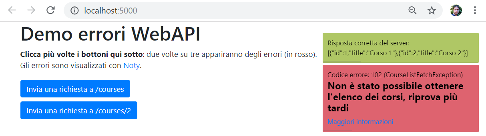

# AspNetCoreWebApiErrorDemo
Questo progetto mostra un'applicazione ASP.NET Core Web API 2.2 che intercetta a livello globale le eccezioni non gestite grazie all'`ExceptionHandlerMiddleware` e restituisce al client un oggetto formattato in JSON contenente informazioni utili.

```
{
  "error":"Non è stato possibile ottenere l'elenco dei corsi, riprova più tardi",
  "reason":"ServerError",
  "type":"CourseListFetchException",
  "code":102,
  "helpLink":"https://example.org/documentation/course-list-fetch-exception"
}
```

Tali informazioni verranno poi visualizzate nella pagina web come avvisi, grazie a [Noty](https://ned.im/noty/#/).




## Panoramica del progetto
 * Il progetto impiega eccezioni personalizzate, come la [CourseNotFoundException](Models/Exceptions/CourseNotFoundException.cs). Ogni eccezione definisce informazioni utili, come un codice identificativo dell'errore, una descrizione sintetica e un link alla documentazione che spieghi le cause e la risoluzione del problema;
 * Queste eccezioni sono sollevate dal [CoursesController](Controllers/CoursesController.cs) con una certa probabilità ogni volta che viene inviata una richiesta alla Web API ([riga 21](Controllers/CoursesController.cs#L21));
 * Grazie all presenza del l'`ExceptionHandlerMiddleware`, tali eccezioni sono catturate a livello globale. Guarda il metodo `Configure` della classe [Startup](Startup.cs) per capire come è stato configurato ([riga 40](Startup.cs#L40));
 * Grazie al middleware, quando si verifica un'eccezione, verrà chiamata l'action `Index` dell'[ErrorController](Controllers/ErrorController.cs);
   * L'action recupera l'eccezione corrente dalle feature del contesto HTTP corrente ([riga 29 del controller](Controllers/ErrorController.cs#L29));
   * L'eccezione viene scritta nel log grazie al servizio `ILogger` di ASP.NET Core ([riga 30 del controller](Controllers/ErrorController.cs#L30));
   * Viene determinato lo status code HTTP per la risposta corrente (diverso da 200, dato che si è verificato un errore), in base alla ragione per cui era stata sollevata l'eccezione ([riga 31 del controller](Controllers/ErrorController.cs#L31));
   * Viene costruito un nuovo oggetto [ErrorDto](Models/Dtos/ErrorDto.cs), a partire dalle informazioni contenute nell'eccezione ([riga 18 del dto](Models/Dtos/ErrorDto.cs#L18));
   * Infine, l'oggetto [ErrorDto](Models/Dtos/ErrorDto.cs) viene restituito dall'action e verrà automaticamente serializzato in JSON da ASP.NET Core Web API ([riga 32 del controller](Controllers/ErrorController.cs#L32)).
 * Il client, che aveva inviato la richiesta, dovrà verificare se il server ha risposto correttamente (cioé con status code 2xx) oppure no ([riga 50 del file index.html](wwwroot/index.html#L50));
   * Se il server aveva risposto correttamente, allora potrà visualizzare i dati nella pagina;
   * Altrimenti, se si era verificato un errore, lo si può visualizzare all'utente usando una libreria tipo [Noty](https://ned.im/noty/#/) ([riga 61 del file index.html](wwwroot/index.html#L61)). La notifica conterrà tutti i dettagli dell'errore.

## Eseguire il progetto
E' sufficiente scaricare i file (o clonare il repository) e poi portarsi nella directory principale del progetto da riga di comando ed eseguire:
```
dotnet run
```
L'applicazione sarà raggiungibile dall'indirizzo http://localhost:5000